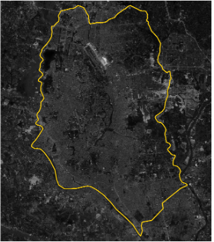
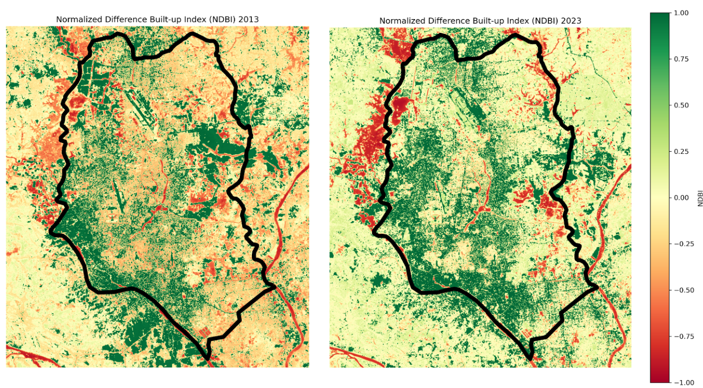
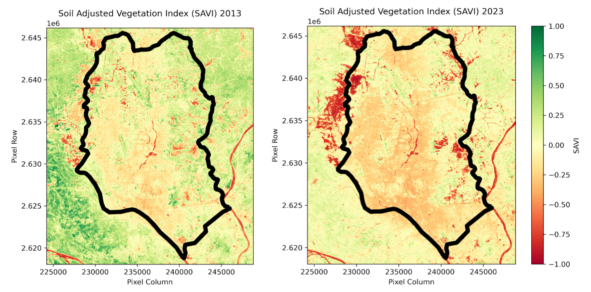
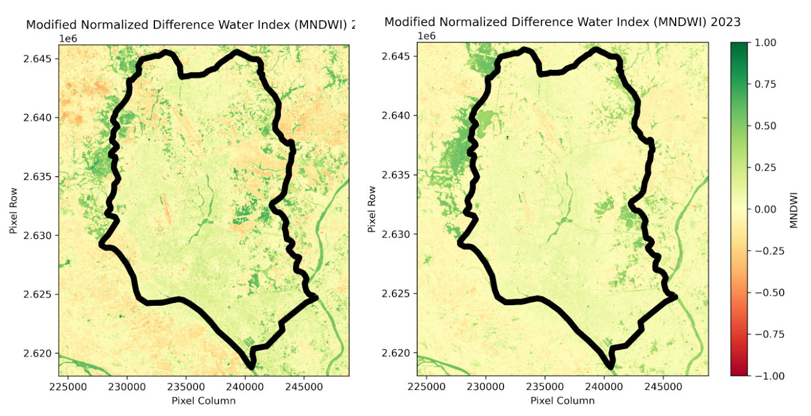
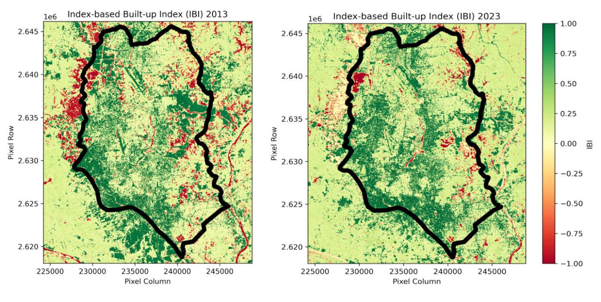
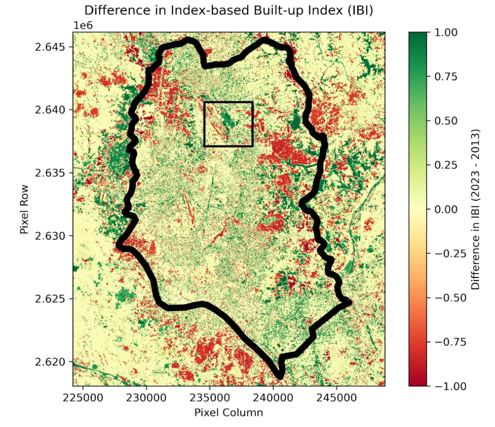
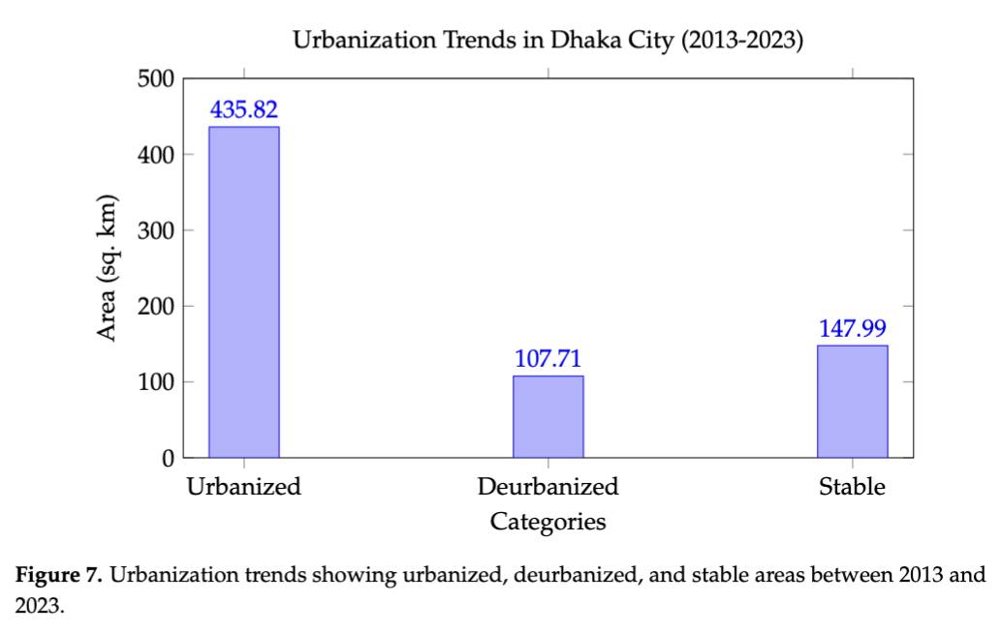
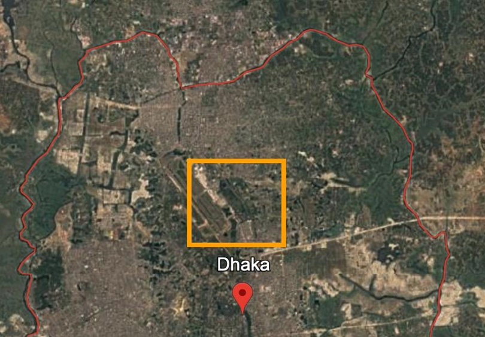
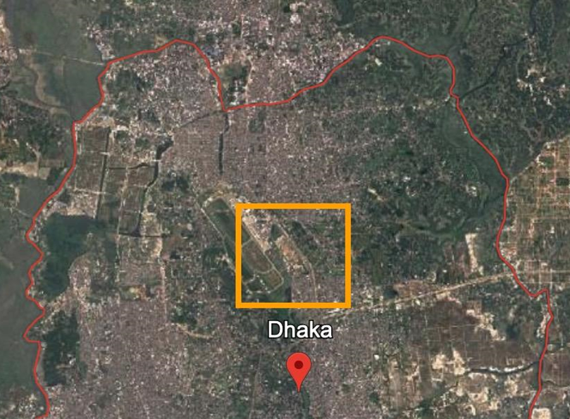

# Analysis Of Urban Sprawl Using Remote Sensing And GIS In Dhaka City

## Abstract
Urban sprawl, the rapid and uncontrolled expansion of urban areas into surrounding rural landscapes, has emerged as a global concern, with the United Nations projecting the population to increase from 7.9 billion in 2023 to 9.8 billion by 2050. Dhaka City, one of the fastest-growing megacities in the world, is experiencing substantial urban expansion, but few studies have leveraged satellite imagery to monitor and quantify these changes. This study investigates urban sprawl in Dhaka City from 2013 to 2023 using Landsat 8 satellite imagery. Spectral indices, including the Normalized Difference Built-up Index (NDBI), Soil-Adjusted Vegetation Index (SAVI), Modified Normalized Difference Water Index (MNDWI), and Integrated Built-up Index (IBI), were applied to analyze changes in land cover. The analysis of a total study area of 691.51 sq. km revealed that 435.82 sq. km (63.02%) became urbanized, 107.71 sq. km (15.58%) underwent deurbanization, and 147.99 sq. km (21.40%) remained stable. These results highlight significant urbanization trends and associated reductions in vegetation and water bodies. The findings underscore the urgent need for sustainable urban planning and management strategies to mitigate the adverse environmental and socio-economic impacts of Dhaka’s rapid and extensive urban growth.

## Introduction
Urban sprawl, characterized by the rapid and uncontrolled expansion of urban areas, poses significant environmental, social, and economic challenges, especially in rapidly developing cities like Dhaka, Bangladesh. This study examines urban sprawl in Dhaka from 2013 to 2023 using remote sensing and GIS tools, leveraging Landsat satellite imagery and the Index-Based Built-Up Index (IBI) to quantify and map urban expansion. The analysis reveals significant growth in built-up areas, accompanied by the loss of green spaces, reduced water bodies, and increased socio-economic pressures such as overcrowding and inadequate infrastructure. By providing a granular understanding of spatial and temporal growth patterns, this research offers valuable insights for policymakers and urban planners to develop data-driven strategies for sustainable urban development while mitigating the adverse impacts of unplanned urbanization.

## Methodology
Remote sensing and Geographic Information System (GIS)-based methods were applied to quantify changes in built-up areas between 2013 and 2023. The study focuses on identifying urban growth patterns by calculating key spatial indices, such as the Normalized Difference Built-Up Index (NDBI), Soil Adjusted Vegetation Index (SAVI), Modified Normalized Difference Water Index (MNDWI), and Index-Based Built-up Index (IBI). These indices enable a comprehensive assessment of built-up expansion, vegetation loss, and water body reduction, providing critical insights for urban planners to address the challenges of unplanned urban growth and promote sustainable development.

The methodology integrates satellite image preprocessing, land cover classification, spatial analysis, and change detection techniques, as detailed in the subsequent subsections.

### Dataset

The primary source of data is multi-temporal Landsat imagery, obtained from the USGS Earth Explorer platform. To minimize temporal inconsistencies, images from September to November with 0% cloud cover are selected. The images are provided in GeoTIFF format and cropped to Dhaka City as the Area of Interest (AOI) by manually generating the KML file from Google Earth. The satellite image containing the boundary of Dhaka is shown in Figure 1.

The specifications of the datasets are as follows:

- **Sensor:** Landsat 8 OLI
- **Details:** Landsat Collection 2 Level-2 Science Products with a spatial resolution of 30 meters.
- **Cloud Coverage:** Imagery with 0% cloud coverage was used.
- **Temporal Coverage:** Imagery acquired for the years **24 December 2013** and **2 November 2023**.
- **Extent:** The study area includes Dhaka Mega City and its surrounding regions. A KML polygon was generated using Google Earth Explorer to define the desired area, and Landsat imagery corresponding to this footprint was downloaded.
- **Data Format:** The imagery was processed and stored in **TIF** format.

<p align="center">
    
</p>

Each image acquisition date was selected to coincide with the November-December dry season, reducing atmospheric distortion and enhancing land-cover visibility. The temporal distribution of these years aligns with major phases of Dhaka’s urbanization, providing a basis for assessing the progressive expansion of urban sprawl.

### Tools and Techniques

The following tools were used to process and analyze the satellite data:

- **QGIS:** An open-source platform for spatial data analysis and visualization, used for pre-processing, classification, and spatial analysis.
- **USGS Earth Explorer:** A platform for acquiring satellite imagery and remote sensing data.
- **Google Earth Engine (GEE):** A cloud-based platform for tasks such as cloud masking, geometric correction, radiometric calibration, and clipping to the AOI (Area of Interest).

### Preprocessing

Satellite images underwent several preprocessing steps to ensure accuracy and consistency:

- **Geometric Correction:** The images were aligned to ensure consistency in spatial resolution and accuracy, facilitating precise comparisons and analysis across datasets.
- **Clipping to AOI:** The Area of Interest (AOI) was defined using Google Earth Engine (GEE) to encompass the geographical extent of Dhaka City. To ensure comprehensive coverage and account for surrounding contextual features, a slight padding was added to the AOI boundaries on each side. The Landsat 8 satellite footprint was then clipped to this adjusted AOI, effectively isolating the relevant spatial extent for further analysis while minimizing unnecessary data outside the study area.

### Urban Sprawl Detection Equations

We used the **Index-Based Built-up Index (IBI)** to detect urban sprawl. IBI is a remote sensing tool used for extracting and quantifying accumulated built-up areas from satellite imagery, normalized to the range of [-1, +1]. The IBI integrates three thematic indices: the **Normalized Difference Built-up Index (NDBI)**, the **Soil Adjusted Vegetation Index (SAVI)**, and the **Modified Normalized Difference Water Index (MNDWI)**.

Formulas for key indices are:

- **Normalized Difference Built-up Index (NDBI):**

  ```
  NDBI = (SWIR - NIR) / (SWIR + NIR)
  ```

- **Soil Adjusted Vegetation Index (SAVI):**

  ```
  SAVI = ((NIR - RED) * (1 + L)) / (NIR + RED + L)
  ```

  where `L = 0.5` is the soil adjustment factor.

- **Modified Normalized Difference Water Index (MNDWI):**

  ```
  MNDWI = (GREEN - SWIR) / (GREEN + SWIR)
  ```

- **Index-Based Built-up Index (IBI):**
  ```
  IBI = (NDBI - (SAVI + MNDWI)) / (NDBI + (SAVI + MNDWI))
  ```

Positive values of IBI correspond to urbanized areas, while negative values reflect non-urbanized regions.

### Change Detection

Urban sprawl detection was performed using the IBI derived from Landsat 8 imagery. Threshold values were applied to classify areas into distinct categories based on changes in built-up intensity:

- **IBI > 0:** Urbanized areas, indicating significant urbanization.
- **IBI between -0.5 and 0:** Stable areas with minimal or no significant changes.
- **IBI < -0.5:** De-urbanized areas, indicating a reduction in built-up surfaces.

These thresholds enabled a systematic and quantitative assessment of urban sprawl across Dhaka City from 2013 to 2023. By classifying the landscape into urbanized, stable, and de-urbanized regions, this approach provides critical insights for sustainable urban planning and management.

## Results and Analysis

After completing the preprocessing steps and calculating different metrics, we obtained the following results.

### NDBI Analysis (2013 vs. 2023)

We calculated the Normalized Difference Built-Up Index (NDBI) for 2013 and 2023 using Landsat imagery to assess urban growth. The results show a significant increase in high NDBI values (Green), reflecting urbanized or built-up areas such as dense human-made structures, including residential neighborhoods, roads, and industrial zones. Conversely, areas with low NDBI values (Red), representing natural features like vegetation or water bodies, have decreased, indicating minimal urban development. The noticeable increase in built-up areas between 2013 and 2023 highlights the extent of urban sprawl in the study region.

<p align="center">
  
</p>

### SAVI Analysis (2013 vs. 2023)

We calculated the Soil Adjusted Vegetation Index (SAVI) for 2013 and 2023 to assess vegetation cover changes in Dhaka City using Landsat 8 OLI imagery. SAVI values closer to 1 represent dense vegetation, such as parks, forests, and agricultural lands, while values closer to -1 indicate sparsely vegetated areas or regions dominated by built-up infrastructure or bare soil. Areas with high SAVI values are represented in green, indicating dense vegetation, while low SAVI values appear in red, reflecting sparsely vegetated or built-up regions. The analysis reveals a clear reduction in green areas within Dhaka’s central and peripheral regions between 2013 and 2023, highlighting the impacts of urban expansion on natural green spaces.

<p align="center">
  
</p>

### MNDWI Analysis (2013 vs. 2023)

The Modified Normalized Difference Water Index (MNDWI) was calculated to analyze changes in water body coverage in Dhaka City between 2013 and 2023 using Landsat 8 OLI imagery. MNDWI highlights water bodies, with higher values indicating features such as rivers, lakes, ponds, or wetlands, while lower values reflect non-water areas like urban regions, vegetated zones, or barren lands. The comparative analysis reveals a significant reduction in water body coverage over the decade, particularly in central and peripheral regions, underscoring the impact of urban expansion on natural water resources.

<p align="center">
  
</p>

### IBI Analysis (2013 vs. 2023)

The Index-Based Built-up Index (IBI) was calculated to measure urban built-up areas in Dhaka City by balancing the contributions of built-up (NDBI), vegetation (SAVI), and water indices (MNDWI). IBI effectively minimizes ambiguities caused by vegetation and water features. Areas with high IBI values are represented in green, reflecting new high-rise developments and infrastructure expansion, while areas with low IBI values appear in red, representing reduced industrial activity, site abandonments, or regions dominated by vegetation or water bodies. The comparison of IBI maps for 2013 and 2023 reveals a significant increase in green areas in 2023, highlighting rapid urbanization.

<p align="center">
  
</p>

### Comparative Analysis: Key Changes in Dhaka’s Urban Landscape (2013 vs. 2023)

The comparative results for NDBI, SAVI, MNDWI, and IBI offer a holistic view of urban changes in Dhaka City. Key observations include:

- **Vegetation Loss**: SAVI analysis indicates a significant reduction in vegetation, particularly in central Dhaka.
- **Water Body Changes**: MNDWI maps show a decrease in water bodies due to urban encroachment.
- **Built-Up Expansion**: IBI values confirm urban sprawl, with notable increases in built-up density.

The analysis reveals that out of the total study area (691.51 sq. km):

- **435.82 sq. km (63.02%)** experienced positive IBI changes, indicating rapid urbanization.
- **107.71 sq. km (15.58%)** showed negative IBI changes, representing deurbanized areas.
- **147.99 sq. km (21.40%)** remained stable, with minimal changes.

<p align="center">
  
</p>

### Urbanization Trends Visualization

The following bar chart summarizes the quantitative analysis of urban sprawl between 2013 and 2023, showing urbanized, deurbanized, and stable areas.

<p align="center">
  
</p>

- **Urbanized**: 435.82 sq. km (63.02%)
- **Deurbanized**: 107.71 sq. km (15.58%)
- **Stable**: 147.99 sq. km (21.40%)

### Verification of Results

To verify the outcomes of this study, historical Google Earth imagery from 2013 and 2020 was analyzed to validate the patterns of urbanization identified through the Index-Based Built-up Index (IBI) difference map. A specific region, highlighted with an orange rectangular boundary in the IBI difference map, was selected based on its indication of significant urban expansion. This region was then cross-referenced with Google Earth images from 2013 (Figure 1) and 2020 (Figure 2) to visually confirm the changes over time.

The 2013 Google Earth image (Figure 1) illustrates a relatively less urbanized landscape within the selected area, featuring sparse built-up infrastructure and more open spaces, vegetation, and natural land cover. In contrast, the 2020 image (Figure 2) reveals a significant transformation, with the emergence of dense urban infrastructure and a noticeable reduction in green or undeveloped spaces. These visual observations align closely with the trends identified in the IBI difference map, reinforcing the reliability of the geospatial analysis.

<p align="center">
  
</p>

<p align="center">
  
</p>

<p align="center">
    Figure: Comparison of urban sprawl in Dhaka City between 2013 and 2023, highlighting significant urban expansion and reduction in green spaces.
</p>

## Conclusion
This study successfully examined the spatiotemporal dynamics of urban sprawl in Dhaka City over the period 2013–2023, employing advanced remote sensing and GIS-based techniques. The analysis revealed several key findings that underscore the challenges posed by rapid urbanization in the region. First, significant urban expansion was observed, particularly in Dhaka’s peripheral areas, as highlighted through the Normalized Difference Built-up Index (NDBI) and Index-Based Built-up Index (IBI) analyses. Second, the Soil Adjusted Vegetation Index (SAVI) results indicated a marked decline in green spaces, both within the city center and its outskirts, reflecting the loss of vegetation due to land-use changes. Third, the Modified Normalized Difference Water Index (MNDWI) maps demonstrated a noticeable reduction in water bodies, attributed to land conversion for urban infrastructure development.

These findings provide quantitative evidence of Dhaka’s rapid and unplanned urban growth, emphasizing the environmental consequences, including vegetation loss and the depletion of natural water resources. Such changes highlight the pressing need for sustainable urban planning and management strategies to address the challenges associated with unregulated urbanization. By integrating multi-temporal analysis and geospatial techniques, this study contributes to a deeper understanding of urban growth patterns and their impacts, offering valuable insights for policymakers and urban planners. Future research should build upon these findings by incorporating high-resolution imagery, predictive modeling, and socioeconomic data to develop comprehensive strategies for sustainable urban development in Dhaka and other rapidly urbanizing cities.